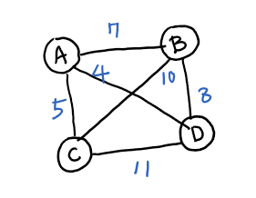
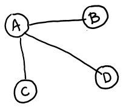
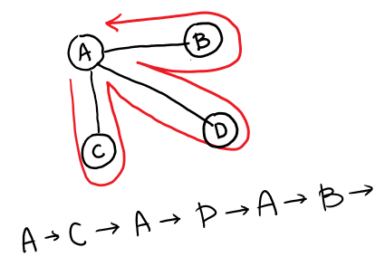

# TSP-2 Huristic



Given **complete** graph, find out **Shortest Hamilton Cycle path** with **TSP-2 Huristic** algorithm.

</br>
    
1. Find Minimum Spanning Tree   
   

   
   </br>
   
2. Traverse MST with recording its path through DFS 
   
   
   
   </br>
   
3. In a sequence of recorded path from DFS above, get Shortest Hamilton Cycle path with no duplicated visit of DFS   
   

   
```
Sequence of  A->C->A->D->A->B
will find `A` first with upcoming `C` as second.
Next `A` is a duplicate one so see coming `D` and add it as a tsp.
Skip `A` as well as before, finally add `B` for last component of tsp.
```
