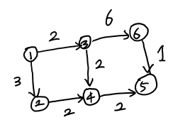

# Dijkstra



Given graph above, finding shortest path from vertex `1` to every single verticies...

</br>

1. Initialize distance table to `INF` and set starting vertex distance as `0`

| 1   | 2   | 3   | 4   | 5   | 6   |
| --- | --- | --- | --- | --- | --- |
| 0   | INF | INF | INF | INF | INF |

</br>  
   
2. Compare distance to adjacent node with distance table, and update its value to minimum

| 1   | 2   | 3   | 4   | 5   | 6   |
| --- | --- | --- | --- | --- | --- |
| 0   | 3   | 2   | INF | INF | INF |

</br>  
   
3. Repeat `2` by searching from shortest distanced node   
   
</br> 
</br>

Method above will took `O(V^2)` while visiting every adjacent verticies in current one.

By using priority queue, time complexity will decrease to `o((V+E)logV)`

Main idea of using priority queue is **push vertex when its distance from src vertex can update distance table.** By doing this, only meaningful vertex has pushed to queue, so do searching adjacent verticies from poped from queue will save time.

</br>

When distance table has updated, by doing updating previous vertex from currently watching vertex we can see the path through from starting vertex by recursion function.

```cpp
void printPath(int start, int curr) {
    if (curr == start) {
        cout << start << "-> ";
        return;
    }

    printPath(start, prevVertex[curr]);

    cout << curr << "-> ";
}
```
