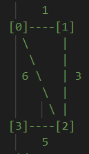
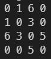

# Floyd-Warshall (All Pair Shortest Path)



Find a shortest path through all vertices to other verticies.

<br/>

1. Creates a grid for weight of edges and initialize grid with adjacent verticies

<br/>

  
(Except grid[a][a], shown `0` in grid would be initialized as `INF`)

2. Loop grid with stage `k`.  
   Stage `k` stands for **way point** of verticies.

```
ex) Stage 3 while looking at source vertex 1, destination vertex 4.

Considering path `1 -> 3 -> 4` is valid.
```

Recurrence relation would be

```
grid[src][dest] = min(grid[src][dest], grid[src][wayPoint] + grid[wayPoint][dest])
```

To check every possible waypoint, repeat those expression for every nodes.

```
for wayPoint in range(leastIndexOfNode, largestIndexOfNode+1):
   grid[src][dest] = min(grid[src][dest], grid[src][wayPoint] + grid[wayPoint][dest])
```

Time Complexity will be `traverse grid * everyNode` = `O(N^2) * O(N) = O(N^3)`
