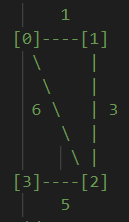
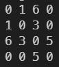

# Floyd-Warshel (All Pair Shortest Path)



Find a shortest path through all vertices to other verticies.

<br/>

1. Creates a grid for weight of edges and initialize grid with adjacent verticies
   
2. Loop grid with stage `k`.  
   Stage `k` stands for **way point** of verticies.

```
ex) Stage 3 while looking at source vertex 1, destination vertex 4.

Considering path `1 -> 3 -> 4` is valid.
```

Recurrence relation would be

```
grid[src][dest] = min(grid[src][dest], grid[src][wayPoint] + grid[wayPoint][dest])
```
