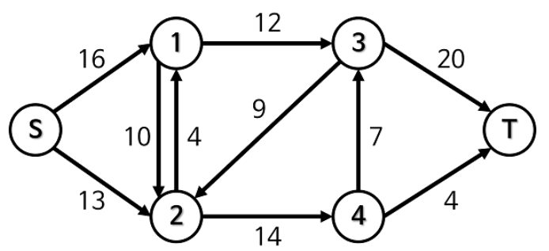
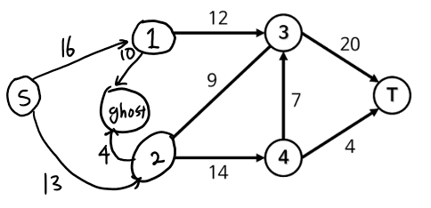

# 최대유량 (애드몬드-카프)

다음과 같이 주어진 그래프에 대해 최대유량을 구해보자.

애드몬드-카프 알고리즘의 특징은 `back edge` 이다.  
하지만 `1` 과 `2` 노드 같이 대칭적으로 간선이 주어진 노드간에는 백엣지 테크닉을 적용할 수 없다.

이를 위해 `1`과`2` 를 잇는 가상의 고스트 노드 하나를 추가한다.

그럼 다음과 같이 나타낼 수 있을 것 이다.

이후 시작 노드에서 bfs/dfs 로 `T` 까지 가는 경로를 찾아 해당 경로에서 최대 유량을 보내면서, 더이상 `T` 까지 갈 수 있는 유효한 간선이 없을 때 까지 이를 반복한다.
