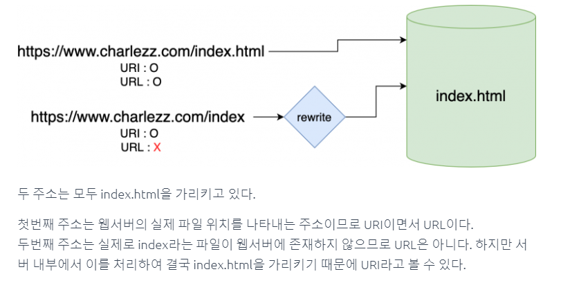

# 14 Feb 2022   
   
## URI & URL   
   
   
   
URL 이 URI의 서브셋이다.   
둘의 차이는 URI는 `명확한 대상을 가리키는 것` 이고 URL은 `대상의 위치`를 가리킨다.   
그래서  `localhost:8080/index` 는 index라는 명확한 파일이 아니라 그 파일을 넘겨받을 수 있는 `위치`니까 URL이고 `localhost:8080/index.html`은 그 파일 자체를 가리키므로 URI이다.   
   
## Bean? static field?   
   
프록시 서버로 요청을 라우팅 하기 위한 `HttpClient` 개체가 있다고 해보자.   
이 개체를 `@Configure` 클래스에서 이를 리턴하는 메소드를 통해 Bean 개체로 등록하는 방법이 있고, 그냥 해당 프록시 개체를 사용하는 클래스에서 하드코딩해서 static field 로 박아넣는 방법이 있을 것 이다.  
   
테크리더님은 성능상의 이슈로 후자가 유리하겠지만 테스트의 유연성을 위해 전자를 선호한다고 하셨다. 정답은 없는 것 같으니 상황에 맞게 잘 응용하면 될 것 같다.   
   
## Exception 처리   
   
`@ControllerAdvice` 어노테이션을 통해 전역적으로 예외를 잡아 처리하는 클래스를 생성할 수 있다.   
컨트롤러, 서비스 레이어에서 예외를 발생시키고, 이 때 Exception 클래스를 따로 만들어서 advice에서 각 exception 의 종류에따라 처리하면 된다.