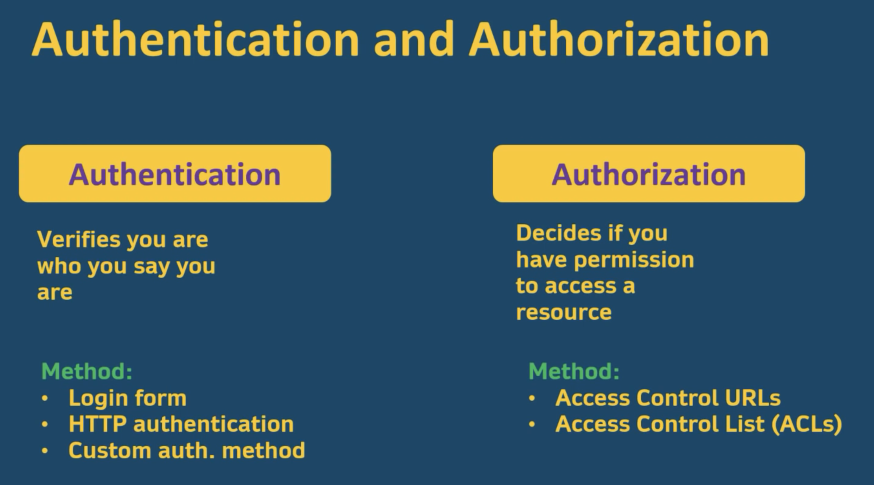

# 20 Jan 2022   
   
Authentication: 내가 이러이러한 사람이다라고 주장할때 이를 확인하는 것.   
Authorization: 내가 나인거는 통과했고 이제 내가 어떤 행동을 하고싶은데 그 행동을 할 권한이 있는지 확인하는것   
   
   
[ref: amigos youtube](https://www.youtube.com/watch?v=VVn9OG9nfH0&t=5658s)   
   
    
   
- OAUTH란? third party 로그인을 위한 표준 프로토콜   
OAUTH2 이전에는 provider 마다 프로토콜이 제각각이었는데 2 부터 통합됨