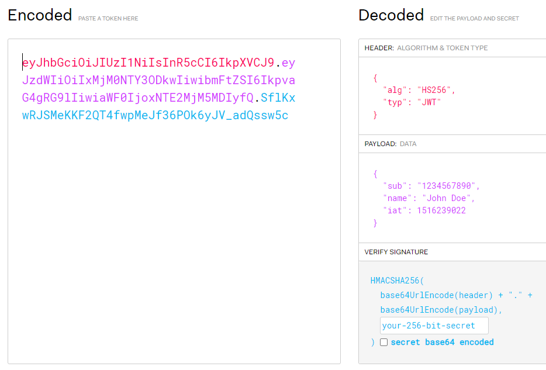

# 22 Jan 2022   
   
오늘은 토요일. 하지만 인턴에게 주말은 없다.   
   
## What is JWT?    
- Cookie:   
  HTTP는 Stateless하다. 따라서 유저가 홈페이지를 사용하는데 있어서 매번 로그인을 해야하는 등 번거로운 일들을 줄여주기 위해 나온게 **Cookie** 이다. Cookie는 클라이언트가 보관하고 **매 request 마다 이 쿠키를 실어서 요청을 보낸다**.   
  클라이언트에서 보관한다는 쿠키 특성 상 누군가 가로챌수가 있다. 장바구니라던지 특정 element 클릭유무 이런 정보들은 문제가 되지 않는다. 하지만 유저의 개인정보같은 민감한 정보는 문제가 된다.   
- Session:   
  위의 문제를 해결하기 위해 나온게 Session이다. 사용자의 민감한 정보는 서버에서 따로 보관을 하되, 해당 memory와 매핑된 id를 하나 만들어서 클라이언트보고 이걸 들고 다니라고 한다. 그럼 사용자는 민감한 정보를 직접 들고 다니는게 아니라, 해당 정보에 접근할 수 있는 키값을 쿠키에 들고다니면서 요청을 하는게 **비교적** 안전하다.
- What is JWT:
     
  JWT는 크게 3 파트로 이루어진다. **Header, PayLoad, Signature**.   
  - Signature:  
  시그니처는 해시값이다. Header와 PayLoad의 Base64 암호화를 거친 문자열을 이은것에 **Server가 들고 있는 secret key를 salt쳐** Signature 라는 해시값을 만든다. 이렇게되면 서버의 secret 값을 모르면 payload를 위변조해도 시그니처가 맞지 않아 검증이 가능해진다.   
  - Header:   
  헤더는 그냥 헤더. payload 복호화를 위한 암호화 알고리즘 방식이 들어있다.   
  - PayLoad:   
  실제 정보. 각 하나의 정보를 Claim이라고 하며 key, value pair로 구성되어있다. 여러가지 Claim정보를 추가할 수 있음.   
  예시에는 없지만 iat(Issued At) 같이 생성시각, exp나 eat 같은 Expire at 과 같은 만료시간도 설정할 수 있다.