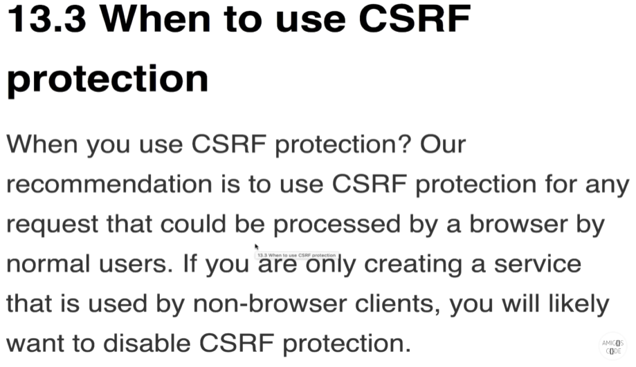

# 26 Jan 2022   
   
3일정도 내부 api 호출 flow를 postman으로 삽질을 했다.   
postman을 그동안 사용했을 때 10% 조차도 제대로 사용을 하지 못하고 있었음을 느꼈다...     
   
Postman의 test단계에서 `pm.enviroment.set("env_key", pm.response.json().someVar)` 와 같이 postman 으로 온 response가 json 타입으로 왔다면 바로 파싱을 해서 enviroment로 설정할 수 있는게 너무 신기했다.   
   
    
   
## PreAuthorize   
   
Security Config에서 antMatchers 를 통해 특정 권한이나 Role을 가진 user만 접근할 수 있게 했었다면   
이걸 각 Controller에 설정할 수 있다.   
   
간단하게 Controller 위에다가 `@PreAuthorize("hasAuthority('ROLE_ADMIN')")` 이렇게 어노테이션을 붙여주면 해당 end point는 `ROLE_ADMIN` 권한을 가진 유저만 접근할 수 있다.   
이거만 하면 끝이 아니라 **Security Config class 위에 EnableGloablMethodSecurity(prePostEnabled = ture)**를 설정해주어야함   
   
       
      
## What is CSRF   
   
Cross Site Request Forgery. 한국말로 하면 사이트간 요청 위조 이다.   
자동로그인이 활성화 된 요즘 사용자들은 어느 웹사이트에 접속 시 브라우저에 해당 웹사이트 자동 로그인을 위한 *(authenticate를 위한) 토큰이 존재한다. 만약 이 상황에서 피싱 사이트에 접속해 어떤 버튼을 클릭했고, **해당 버튼에 등록된 이벤트 핸들러에서 브라우저의 토큰을 집어다가 사용자인척 웹페이지에 post 같은 요청을 보낼 수 있다.**
이걸 막는게 csrf 이다.   
   

   
만약 브라우저 환경의 클라이언트가 존재하지 않는 서비스하면 이걸 꺼도 된다.