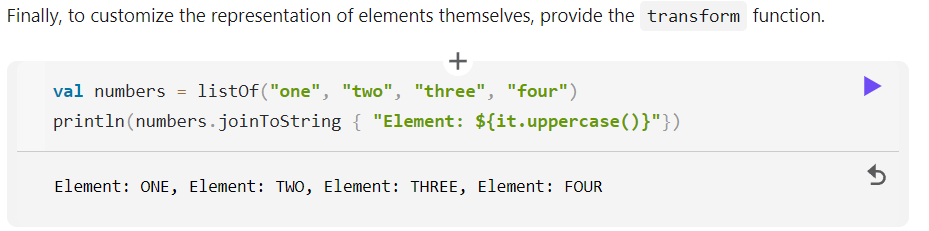

# 31 Jan 2022   
   
Kotlin을 개발한 Jet Brain에서 kotlin 튜토리얼을 공짜로 제공한다. 영어인게 단점   
   
## listOf   
   
기존의 자바에서 List.of 를 하나의 함수로 묶은 기능   
    
``` kt 
val grid = arrayListOf(
    arrayListOf('A', 'B', 'C'),
    arrayListOf('D', 'E', 'F')
    arrayListOf('G', 'H', 'I'),
)
```   
이런게 가능하다.   
   
</br>

## Pair   
   
Cpp 에서 Java로 넘어오면서 pair 가 그리웠는데 코틀린에서 이를 다시 제공해준다.   
   
`val pair = Pair<Int, String>(3, "hello")`   
이렇게 사용 가능.   
   
</br>

## joinToString   
   
위의 예시에서 사용했던 grid의 원소 사이사이에 공백을 넣어 출력하려면 이중 for문으로 행마다 `System.lineSeperator()`를 원소 사이마다 공백을 출력하는데 맨 마지막 원소는 끝에 공백을 또 빼주는 번거로운 작업대신에 이 함수를 쓰면 된다   
   
``` kt
println(
    grid.joinToString(System.lineSeperator()) { it.joinToString(" ") }
)
```   
처음에는 알아먹는데 시간이 좀 걸렸는데 익숙해지면 편할 것 같다.   
it가 joinToString 메소드 실행 시 각각의 원소들에 대해 map 메소드를 실행한거랑 같음. transform function   
   

