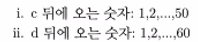
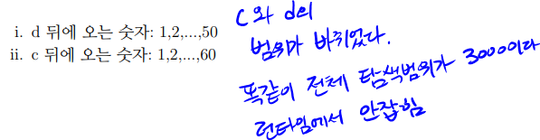
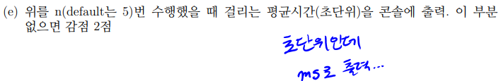

# 2021 2학기 네트워크 프로그래밍 중간고사 코딩문제

- 상황:  
  교수님이 중간고사 문제 대비로 작년 기출문제를 알려주셨고 이에 대한 솔루션을 시험 전에 미리 작성. 시험 당일 날 **기출문제에서 수정된 변수 범위를 제대로 검사하지 못해, 추가 요구사항까지 반영한 코드를 완성했었으나 인자값을 잘못 전달해 추가점수는 물론이고 기본점수에서도 까임**  
   기존에는 c = \[1,50\], d = \[1,60\] 이었으나 시험 당일은 c와d의 범위가 바뀜. 출력값 단위 안지킴

기출:

시험:

---

- 앞으로는?:  
   알고리즘 문제를 풀때도 그렇고 문제 설명을 제대로 읽지 못해 삽질했던 경험이 많았음. 결국에는 문제의 요구조건(변수의 범위, type에 따른 over, underflow 방지) 을 꼼꼼하게 확인해보는 습관을 가져야 함. 한번 슥 보고 넘기지 말고 문제의 요구조건은 종이에 다시한번 적으면서 작성한 코드와 비교하는 습관을 들이자.  
   이번 문제에는 해당되지 않았지만 런타임에서 이런 실수를 잡아 낼 예외처리도 필요할 듯 함.(변수의 범위가 바뀜에 따라 FileNotFound Exception이 특정 구간에서 연속적으로 발생했을텐데 이를 다음에는 어떻게 잡아낼지 생각해봐야함)
