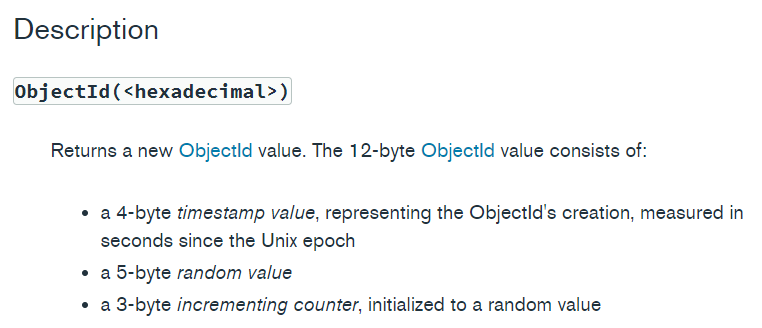

# Object Id

Unlike sql database, Nosql database identify queires as **ObjectId** which is a technichally a hash value instead of growing integer.


(more info at [https://docs.mongodb.com/manual/reference/method/ObjectId/](https://docs.mongodb.com/manual/reference/method/ObjectId/))

So, if I inspect an new instance of ObjectId with `console.log`

```js
const { ObjectId } = require('mongodb');

...

const newId = new ObjectId();
console.log(newId); // new ObjectId("610f8abac59dae8c2513583e")
```

this will show result of an overloaded `toString()` method.

Basically, what is stored in database is an **binary** data of such string `610f8abac59dae8c2513583e`

```js
const newId = new ObjectId();
console.log(newId.id); //<Buffer 61 0f 8c 6e 7d e1 62 ab 65 11 d3 1a>
```

By using this, let's find out more of using this in [find](./../find_mongodb)
