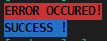

# Chalk

`$ npm i chalk`

[https://www.npmjs.com/package/chalk](https://www.npmjs.com/package/chalk)

Make log in console prettier.

```js
const chalk = require("chalk");

console.log(chalk.yellow("Hello")); // print `Hello` with yellow colored

const ERR = chalk.bold.rgb(0, 0, 0).bgRed;
const SUCCESS = chalk.bold.rgb(0, 0, 0).bgBlue;

console.log(ERR("ERROR OCCURED!"));
console.log(SUCCESS("SUCCESS!"));
```


