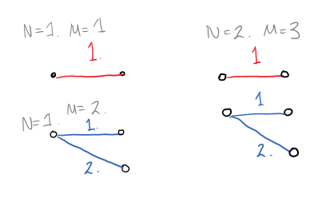

# 다리놓기

[https://www.acmicpc.net/problem/1010](https://www.acmicpc.net/problem/1010)

</br>   
   
문제 유형이 DP인걸 몰랐으면 못풀었을 듯 하네... 
   
   
   
이렇게 새로운 단계는 내 직전 단계와, 직전 단계에서 도착지가 하나 빠진것의 합이다.   
   
```
cell[i][j] = cell[i][j-1] + cell[i-1][j-1];
```
