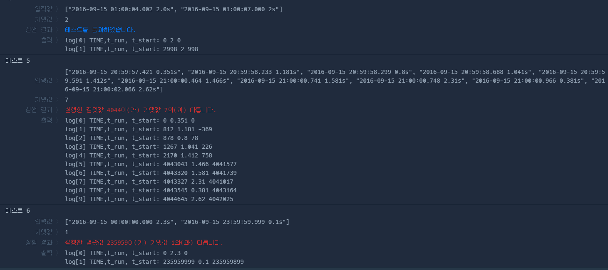

# 추석 트래픽

[https://programmers.co.kr/learn/courses/30/lessons/17676](https://programmers.co.kr/learn/courses/30/lessons/17676)

    
   
---   
`"2016-09-15 hh:mm:ss:ms [R]s"`   
다음과 같은 형태로 `날짜고정`, `시간:분:초:밀리초`, `최대소수점3자리 초단위` 로 문자열이 주어진다.   
   
날짜가 고정이므로 `s[11]` 부터 시간에 대한 정보를 받아오면 된다.   
문자열 조각을 `atoi(s.c_str())` 로 정수로 변환해 저장했고   
실수형 시간의 경우 **`atof(s.c_str())`** 로 받았다   
   
`종료시각 - 수행시간`은 시작 시간이므로, 위의 정보를 통해 시작 시간까지 구할 수 있다.   
   
    
출력 순서대로 `종료시간` `수행시간` `시작시간`

단위가 밀리초 이므로 반복자 `i` 에 1000을 곱해 `시작 시간보다 크지만 종료 시각보다 작은 시점`에 cnt를 증가시켜 배열에 저장해 원소의 최대값을 구하면 된다.

내가 한 실수는  
**시간, 분을 초단위로 변경하지 않고 (ex) 10h -> 36000sec) 그냥 문자열로 받았던 점**

나중에 다시 풀어볼때는 이 점 실수하지 않고 다시 풀어봐야 겠다.
