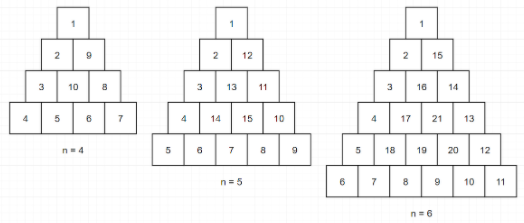

# 삼각 달팽이

[https://programmers.co.kr/learn/courses/30/lessons/68645](https://programmers.co.kr/learn/courses/30/lessons/68645)

---



위와같은 삼각형들을 왼쪽으로 쫙 땡겨서

```
ㅁ
ㅁㅁ
ㅁㅁㅁ
ㅁㅁㅁㅁ
```

이런식의 2차원 배열을 떠올리는게 포인트.

---

내가 특히나 반복문에서 증감하는 변수처리할 때 힘들어하는 부분인데,

```cpp
int x;
while(i--){
    x++;
}
```

i가 0이 되는 순간, `x`는 증가가 되어있는 상태임을 자꾸 까먹음.

```cpp
int x;
while(1){
    i--;
    if(!i)
        break;
    x++;
}
```

이렇게 짜야지 실수를 안하려나?

---

```
ㅁ
ㅁㅁ
ㅁㅁㅁ
ㅁㅁㅁㅁ
```

이 삼각형에서 내려가거나, 맨 밑에서 오른쪽으로 갈때는 2차원 배열의 좌표값을 x와 y중 하나만 신경쓰면 되지만 문제는 계단타고 사선으로 올라갈 때.  
위에서 언급한 반복문에서의 증감에서 사선타고 올라갔다가 다시 내려갈 좌표를 찍어주기 위해서는 반복문이 끝났을 시점에 `a[y][x]` 에 있어서

```cpp
x += 2;
y += 1;
```

이 되어야 맞다.
