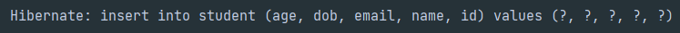
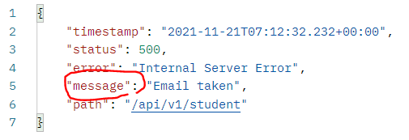

# application.properties 설정

```java
spring.datasource.driver-class-name=com.mysql.cj.jdbc.Driver
spring.datasource.url= /*url:port/table*/
spring.datasource.username= /*username*/
spring.datasource.password= /*password*/
spring.jpa.show-sql=true    // displaies sql
spring.jpa.hibernate.ddl-auto=create-drop   // 테스트 시 설정. 매 프로그램 시작마다 테이블 초기화됨
```



`spring.jpa.show-sql = ture` 할 시 이렇게 콘솔창에 sql 쿼리문 display 해줌

---

\+ 추가

```java
server.error.include-message = always
```

Typescript + express에서는 error throw 하면 잡아다가 return status랑 다 설정해줘야 했는데 spring은 지가 알아서 잡아다가 status code랑 다 설정해서 응답해준다.

다만 저 위에꺼를 설정해야지 message 부분이 나옴


