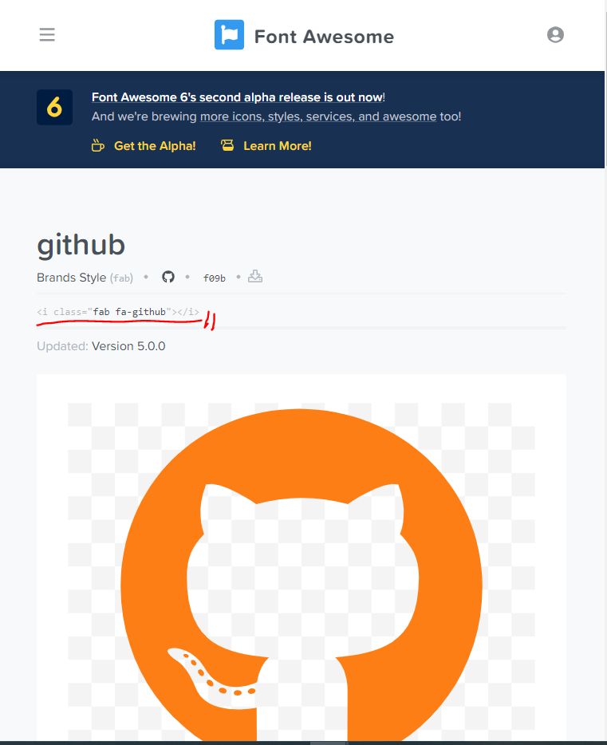

# How to use fontawsome

1. Sign up [FontAwsome](https://fontawesome.com/)
2. Check the profile tab at upper-right and go to [Font Awsome CDN](https://fontawesome.com/account/cdn)
3. Copy the CDN such, `<link rel="stylesheet" href="https://use.fontawsome.com/,,,">`
4. Paste it inside to `<head>` tag in html file.  
     

---

  
Visit [Icons](https://fontawesome.com/icons?d=gallery) for icons and choose one.

Copy those _red-lined_ link and paste that `i` tag to where you want to put img at.
